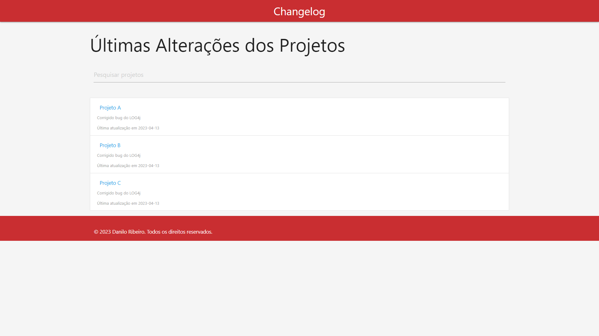

# changelog

Um changelog é um registro ou documento que acompanha as mudanças em um projeto de software ao longo do tempo. O objetivo principal de um changelog é fornecer uma descrição detalhada e organizada das alterações feitas em uma versão específica do software.

O conteúdo de um changelog pode variar de acordo com o projeto, mas geralmente inclui informações como:

* Número da versão: número que identifica a versão do software.
* Data de lançamento: data em que a versão foi lançada.
* Lista de alterações: uma lista detalhada das alterações feitas em cada versão, incluindo correções de bugs, novos recursos, melhorias de desempenho e outras mudanças relevantes.
* Instruções de atualização: informações sobre como atualizar para a nova versão do software, incluindo quaisquer requisitos de sistema ou configurações necessárias.

Alguns projetos de software também incluem outras informações em seus changelogs, como capturas de tela ou exemplos de código para ilustrar as mudanças. Além disso, o changelog pode ser usado como um recurso útil para ajudar os usuários a entender o que mudou em cada versão e como as mudanças afetam o uso do software

# Docker
Repositório [Docker hub](https://hub.docker.com/repository/docker/danilo1337/changelog/general)


* crie um arquivo docker-compose.yaml

```yaml
version: "3.7"
services:
    springboot:
      image: danilo1337/changelog:latest 
      ports:
        - '8080:8080'
```

* Execute os comandos
``` shell
$ docker-compose pull
$ docker-compose up -d
```


* Acesse a página do projeto

#### http://localhost:8080/static/index.html




______________________________

## Scripts para carga inicial
### Windows
```bat
@echo off

PowerShell -Command "Invoke-RestMethod -Uri 'http://localhost:8080/projects' -Method POST -ContentType 'application/json' -Body '{\"name\": \"Projeto A\",\"lastUpdated\": \"2023-04-13\",\"infoLink\": \"https://dominio.com.br/projeto-a\",\"description\": \"Corrigido bug do LOG4j\",\"color\": \"blue\"}'"


PowerShell -Command "Invoke-RestMethod -Uri 'http://localhost:8080/projects' -Method POST -ContentType 'application/json' -Body '{\"name\": \"Projeto B\",\"lastUpdated\": \"2023-04-13\",\"infoLink\": \"https://dominio.com.br/projeto-b\",\"description\": \"Corrigido bug do LOG4j\",\"color\": \"blue\"}'"


PowerShell -Command "Invoke-RestMethod -Uri 'http://localhost:8080/projects' -Method POST -ContentType 'application/json' -Body '{\"name\": \"Projeto C\",\"lastUpdated\": \"2023-04-13\",\"infoLink\": \"https://dominio.com.br/projeto-c\",\"description\": \"Corrigido bug do LOG4j\",\"color\": \"blue\"}'"

pause
```

### Linux
```shell
#!/bin/bash

curl --location 'localhost:8080/projects' \
--header 'Content-Type: application/json' \
--data '{
    "name": "Projeto A",
    "lastUpdated": "2023-04-13",
    "infoLink": "https://dominio.com.br/projeto-a",
    "description": "Corrigido bug do LOG4j",
    "color": "blue"
}'


curl --location 'localhost:8080/projects' \
--header 'Content-Type: application/json' \
--data '{
    "name": "Projeto B",
    "lastUpdated": "2023-04-13",
    "infoLink": "https://dominio.com.br/projeto-b",
    "description": "Corrigido bug do LOG4j",
    "color": "blue"
}'
```


